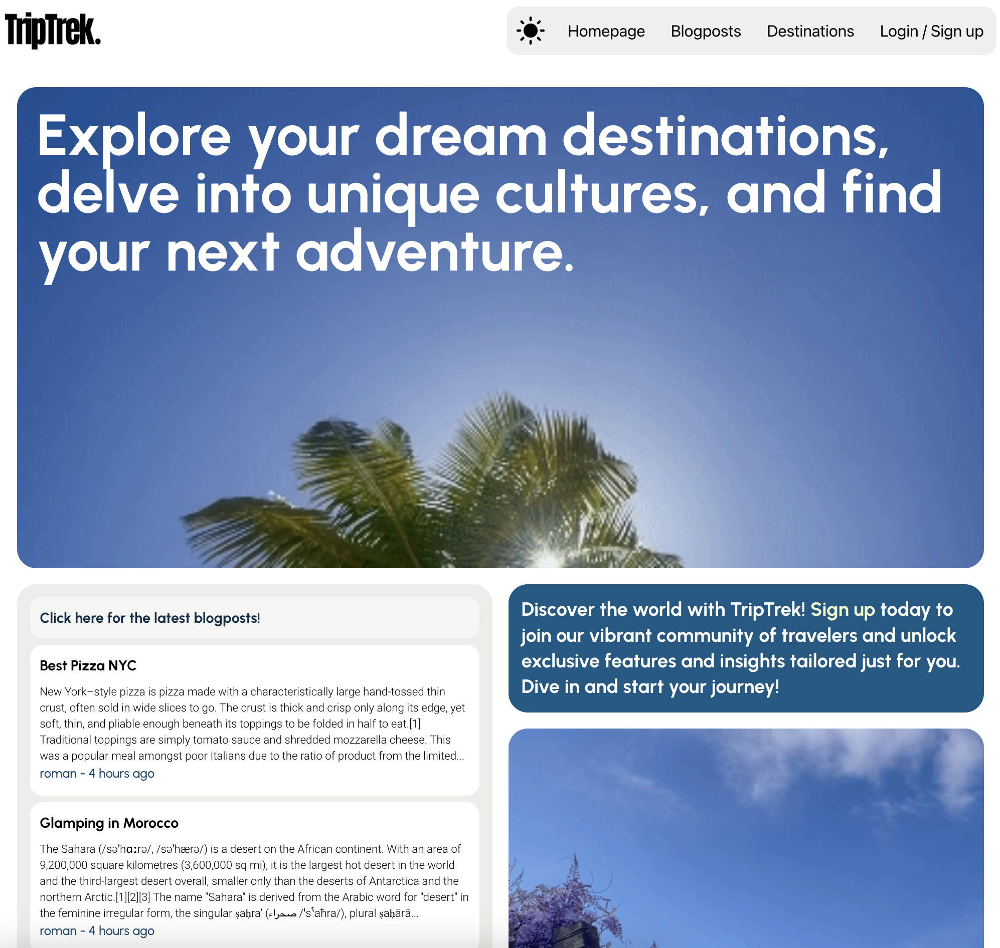
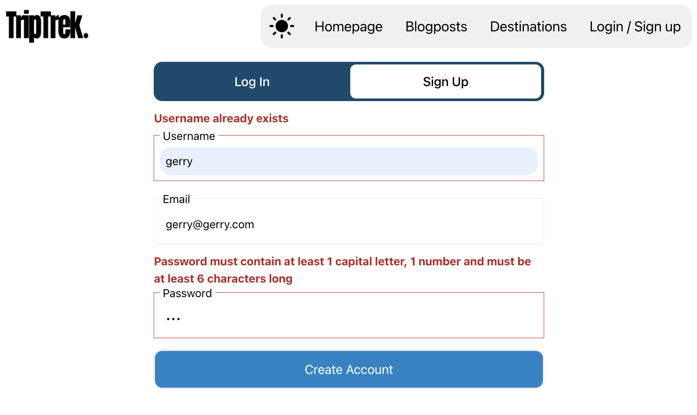
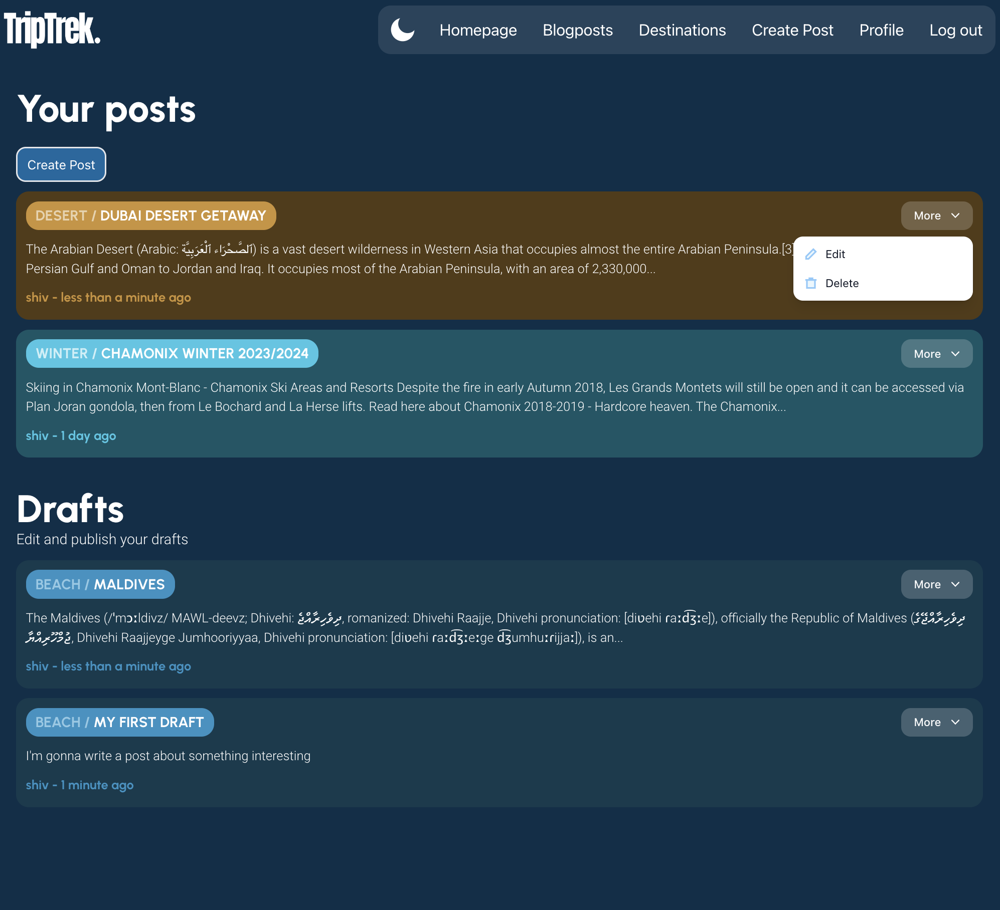
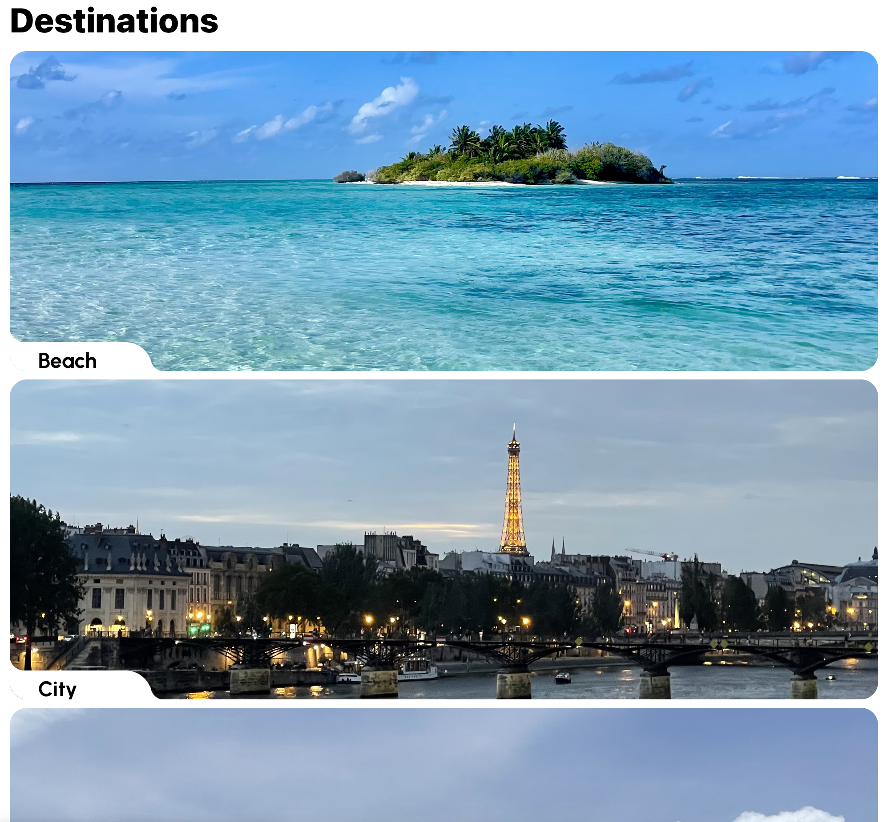
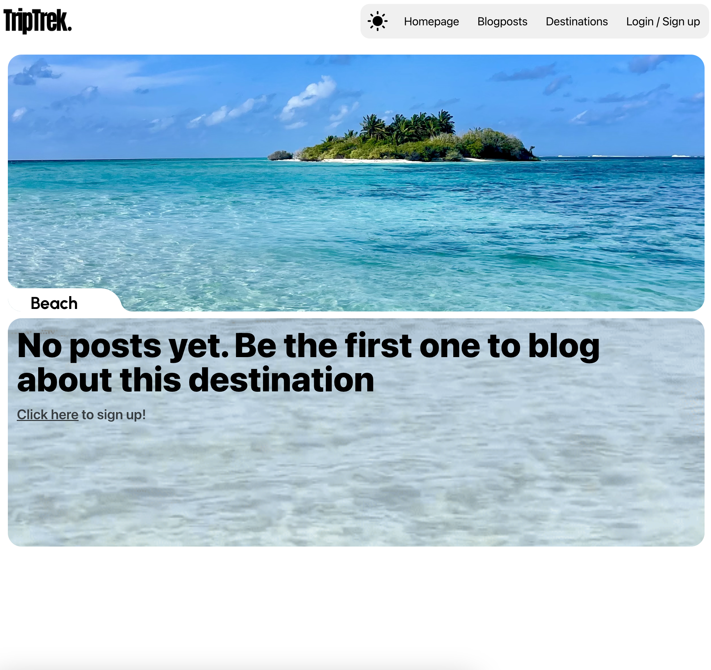
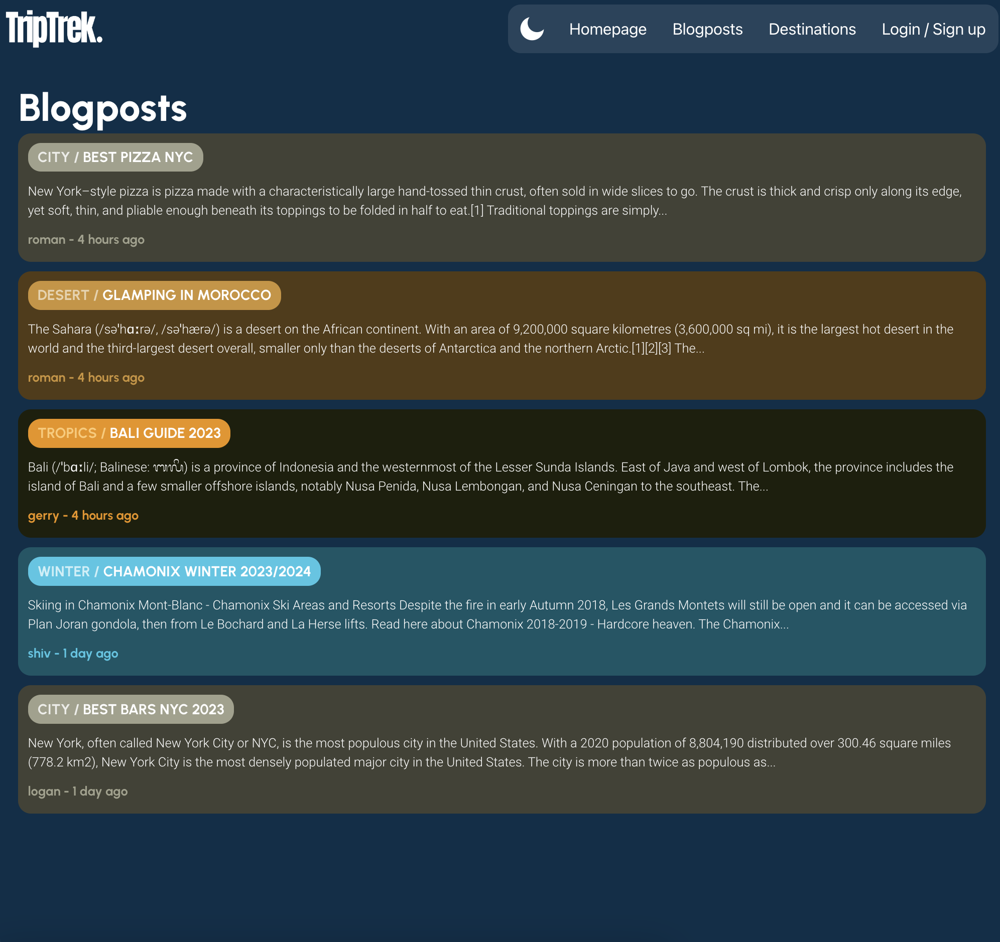
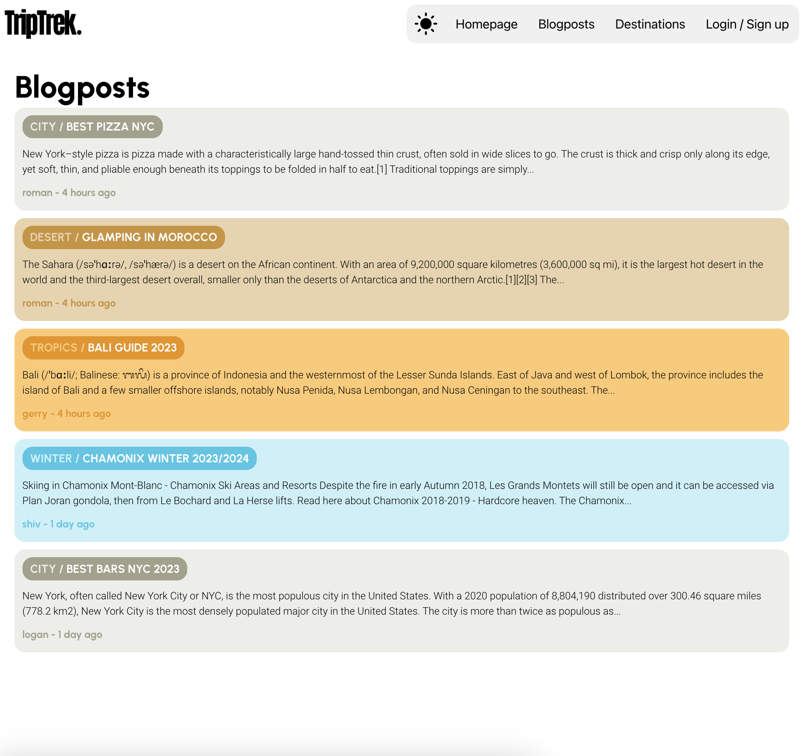
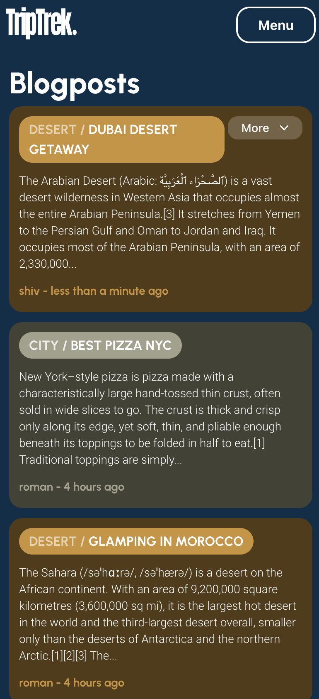
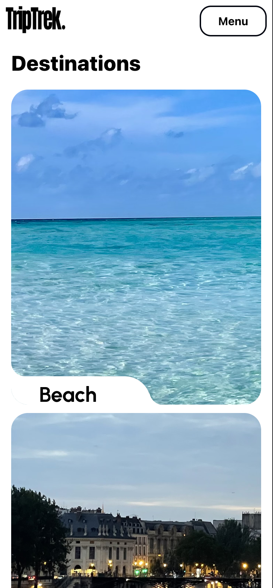
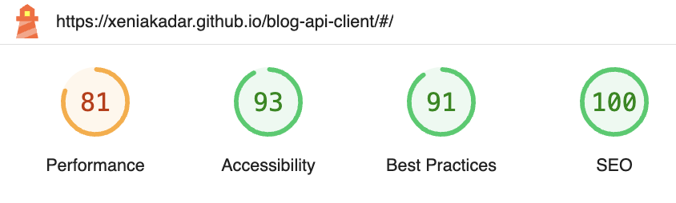

# TripTrek Blog

## Link to the API
[Blog Api](https://github.com/xeniakadar/blog-api)

## Short Description
The app is a dynamic blogging platform where users can share their thoughts and experiences on a variety of topics ranging from beach escapades to city explorations. Each blog post is categorized under specific themes, offering a unique color-coded presentation for easy navigation. Users can engage further by leaving comments on individual posts, fostering a vibrant community of like-minded individuals. Built with React, the front-end provides a seamless and interactive user experience, enhanced by theme-context and efficient API integrations.

## Demo
Click [here](https://xeniakadar.github.io/blog-api-client/#/) for the live demo. If you don't want to make an account, feel free to use the username
**test123** and password **Test123**.

## Showcase
Here's the live preview of the website. Scroll to get a more detailed explanation for each step. Check out the cool light/dark mode toggle!

First, the user is taken to the homepage, where they are invited to explore the blogposts, they are shown the 2 latest blogposts posted (the color of that container changes depending on the topic of the latest blogpost). If the user is singed in, they're invited to create a new blogpost, if they are not signed in, they're invited to create an account or sign in.

When a user creates an account, the user is told if the username is already taken, if the email is valid or if the password is secure enough. Same goes for the login info.

The user can explore blogposts by topics and can even click on a user to check out all the blogposts by them. When the user is logged in, they can go on their profile and take a look at the posts they've posted, or posts they have saved in drafts.

This was a mobile first design, so here are some previews of the mobile version of the app:
 

## Performance
I used Google Lighthouse to run over my application to check its performance, accessibility, use of best practives and SEO opitimization.

## Tech Stack
- React.js
- Tailwind CSS
- Node.js
- Express
- MongoDB

## What I've learned

**Full-Stack Integration**: Gained hands-on experience in creating a full-stack application by integrating a React-based frontend with an Express.js backend, learning the intricacies of routing, API calls, and data management between client and server.

**Frontend Enhancements with React**: Improved UI/UX design skills by utilizing React's component-based architecture, state management, and context API. Leveraged libraries like Tailwind CSS to ensure responsive design, and optimized the user experience with features like themed layouts.
